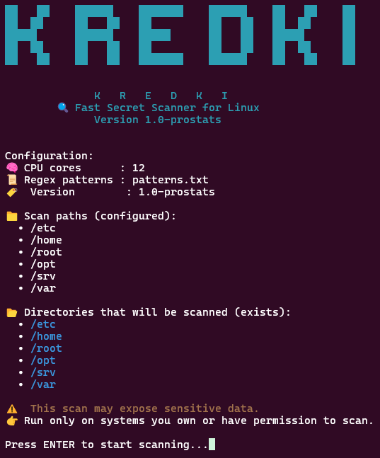
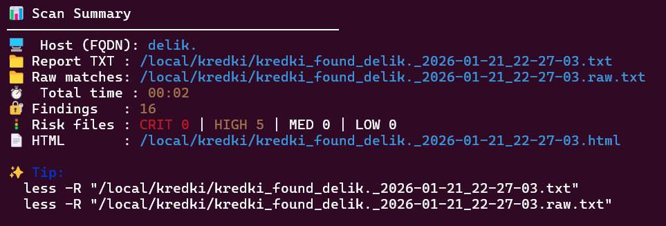
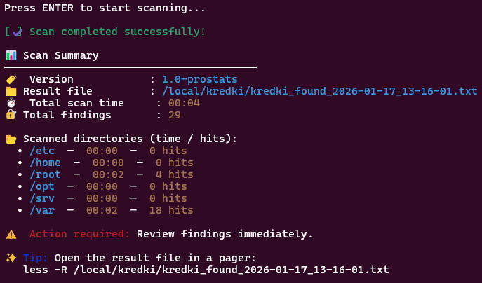
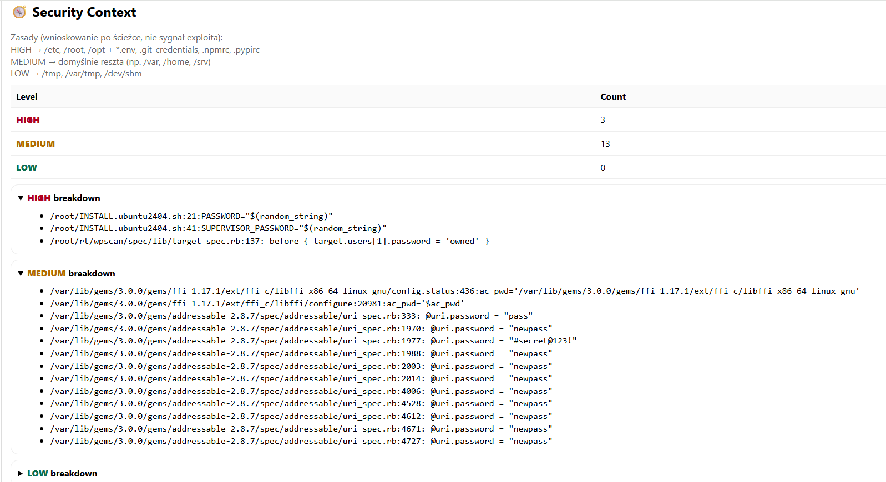
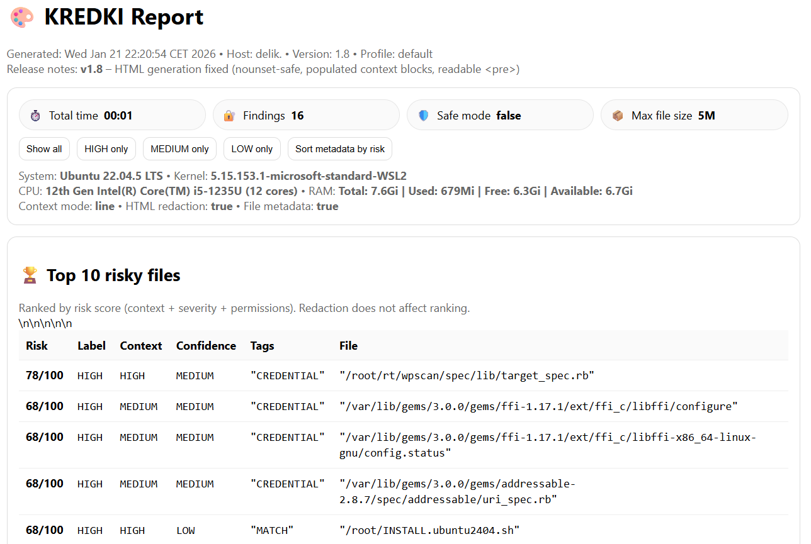

# 🎨 KREDKI

<p align="center">
<b>Local security audit & context-aware risk analysis for Linux</b><br/>
<b>Lokalny audyt bezpieczeństwa i analiza kontekstu ryzyka dla Linuxa</b>
</p>

---

## 🌍 Language / Język

- 🇬🇧 **English** – main content  
- 🇵🇱 **Polski** – sections marked with 🇵🇱  

This single README follows common **GitHub open‑source standards**:
- English as the primary language
- Polish provided inline for local / regional users
- One file (`README.md`) rendered directly on the project page

---

## 🔎 What is KREDKI? / Czym są KREDKI?

**KREDKI** is an open‑source tool for **local security auditing and context‑aware analysis**
of Linux systems.

🇵🇱  
**KREDKI** to narzędzie open‑source do **lokalnego audytu bezpieczeństwa i analizy kontekstu**
systemów Linux.

It detects **credentials, secrets, and sensitive data** (passwords, API tokens, private keys),
and evaluates them based on **real‑world exposure and location risk**.

🇵🇱  
Wykrywa **poświadczenia, sekrety i dane wrażliwe** (hasła, tokeny API, klucze prywatne)
z uwzględnieniem **rzeczywistego ryzyka ich ekspozycji**.

### Design principles
- ✅ audit & defensive tool  
- ✅ fully local (no outbound traffic)  
- ✅ production‑safe (read‑only)  
- ❌ not a pentest tool  
- ❌ no exploitation, no system modification  

> ⚠️ Run only on systems you own or have explicit permission to audit  
> ⚠️ Uruchamiaj wyłącznie na systemach, na które masz zgodę

---

## 🆕 Release: v1.8.5 (current)

### What’s new
- ✅ Stable HTML report generation (Ubuntu + RHEL 9.x)
- ✅ RHEL‑safe handling of `df` / broken mounts (`rc=1` tolerated)
- ✅ TXT and HTML reports always generated (best‑effort)
- ✅ Separate `*.redacted.txt` when `--redact` is enabled
- ✅ Correct permissions (`600`) for TXT, HTML and redacted reports
- ✅ Unified versioning in CLI, TXT and HTML
- ✅ Hardened Bash logic (`set -euo pipefail` safe)

🇵🇱  
**Najważniejsze zmiany**:
- stabilne raporty HTML
- odporność na błędy mountów (RHEL, CIFS, FUSE)
- osobny plik `*.redacted.txt`
- poprawne uprawnienia plików raportów

---

## 📸 Screenshots

Images are rendered directly from the `screenshots/` directory.







---

## 🚀 Why KREDKI? / Dlaczego KREDKI?

Most scanners answer:

> “Is there a secret?”

KREDKI answers:

> **“How risky is this secret in this exact location?”**

| Location | Risk |
|--------|------|
| `/root/.env` | 🔴 HIGH |
| `/etc/app/config.yml` | 🔴 HIGH |
| `/home/user/.env` | 🟠 MEDIUM |
| `/tmp/test.txt` | 🟡 LOW |

🇵🇱  
Ten sam sekret w różnych lokalizacjach oznacza **inne ryzyko biznesowe**.

---

## ✨ Key Features / Funkcje

- Recursive filesystem scanning
- Very fast matching (`ripgrep`)
- Context‑based risk scoring (HIGH / MEDIUM / LOW)
- Profiles: `default`, `prod`, `dev`, `ctf`
- Safe Production Mode
- Secret redaction (safe to share)
- TXT + audit‑grade HTML reports
- `.kredkiignore` support
- No agents, no cloud, no telemetry

---

## 📦 Requirements

- Linux
- `bash` ≥ 4.x
- `ripgrep`

```bash
sudo apt install -y ripgrep
```

---

## 📁 Installation

```bash
git clone https://github.com/radektv/kredki.git
cd kredki
chmod +x kredki-ui.sh
```

---

## ▶️ Usage Examples (CLI Cookbook)

```bash
./kredki-ui.sh --paths /etc,/home --html
./kredki-ui.sh --profile prod --safe --html
./kredki-ui.sh --html --redact --context-mode file
./kredki-ui.sh --non-interactive --html
```

🇵🇱  
Przykłady są **w pełni zgodne z `--help`** i gotowe do CI/CD.

---

## 📄 Reports

Generated files:
- `kredki_found_*.txt`
- `kredki_found_*.html`
- `kredki_found_*.redacted.txt`

All reports are created with **permissions `600`**.

---

## 🧭 What KREDKI is NOT / Czym KREDKI nie są

- ❌ pentest framework
- ❌ privilege escalation tool
- ❌ network scanner
- ❌ SaaS / cloud service
- ❌ telemetry or data collection agent

---

## 📜 License

MIT License — use responsibly.

---

## 🧩 Project Philosophy / Filozofia

> **Security findings without context are just noise.**  
> 🇵🇱 *Wyniki bezpieczeństwa bez kontekstu to tylko szum.*

KREDKI focuses on **meaningful, real‑world risk**, not raw findings.
